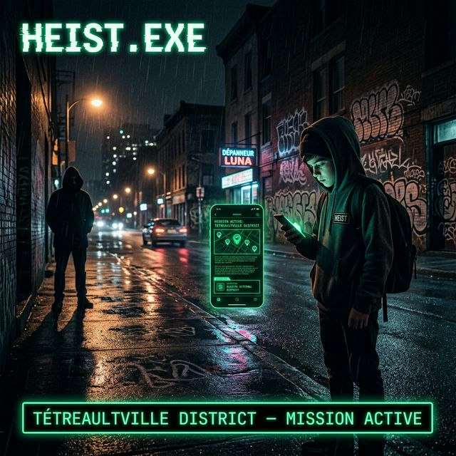
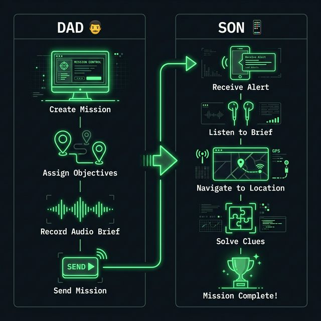
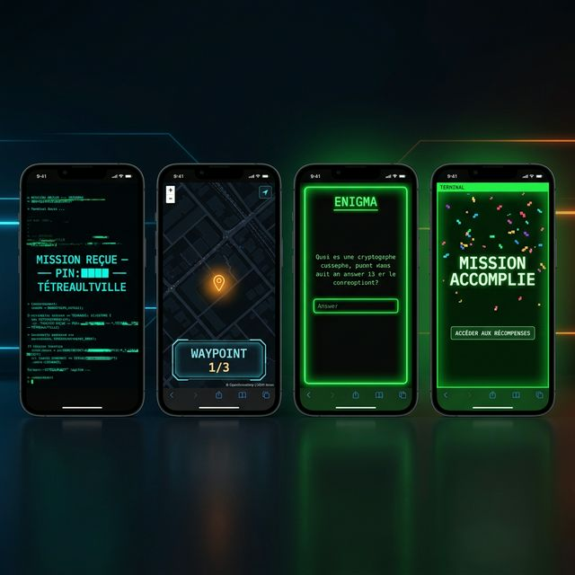

<div align="center">



<br/>

[](https://github.com/portefolio/heist_exe/releases/tag/v1.0.0)
[](https://fastapi.tiangolo.com)
[](https://react.dev)
[](#)
[](https://docker.com)
[](#)
[](https://openstreetmap.org)
[](#)
[](CHANGELOG.md)
[](LICENSE)
[](https://cotcollective.github.io/heist_exe/)

<br/>

### *Transforme ton quartier en mission d'espionnage.*
### *Papa crée. Le fils joue. Montréal ne sera plus jamais pareil.*

<br/>

```
╔════════════════════════════════════════════╗
║  > CONNEXION SÉCURISÉE ÉTABLIE            ║
║  > AGENT IDENTIFIÉ : TÉTREAULTVILLE       ║
║  > OBJECTIFS CHARGÉS : 3 waypoints        ║
║  > MESSAGE AUDIO : CHIFFRÉ               ║
║  > DURÉE DE MISSION : 45:00 ██████░░░░   ║
║  > STATUT : EN ATTENTE DE TON PREMIER PAS ║
╚════════════════════════════════════════════╝
```

</div>

---

## 🕹️ Keskon fait ici ?

**HEIST.EXE** est une plateforme de **jeu d'aventure urbaine** conçue pour être jouée dans les vraies rues.

**C'est simple :** Papa ouvre le panneau admin depuis son ordi, crée une mission secrète avec des waypoints GPS, des énigmes et un message vocal crypté. Il envoie un lien + PIN à son fils. Le fils installe l'app sur son cell (PWA = pas de store, pas de compte), et part en mission dans le quartier.

> *Ça ressemble à un jeu vidéo. Ça se joue dans la vraie vie.*

---

## 🎬 Comment ça marche

<div align="center">



</div>

| Étape | Papa 👨 | Fils 📱 |
|-------|---------|---------|
| 1 | Ouvre `http://localhost/admin` | — |
| 2 | Entre la clé admin (`ADMIN_KEY`) | — |
| 3 | Crée la mission : lore, waypoints GPS, énigmes, audio | — |
| 4 | Envoie lien + PIN 📲 | Reçoit le lien |
| 5 | — | Entre le PIN → **Briefing crypté** 🔐 |
| 6 | — | Écoute le message audio 🎧 |
| 7 | — | Suit la carte OpenStreetMap 🗺️ |
| 8 | — | Trouve le point → résout l'énigme 🧩 |
| 9 | — | **MISSION ACCOMPLIE** → Récompense 🏆 |

---

## 📱 L'app en action

<div align="center">



*Boot → Map GPS → Énigme → Victoire*

</div>

---

## 🌆 Mission démo incluse — Tétreaultville, Montréal

Lance `make seed` et une mission complète est déjà injectée et prête à jouer :

```
> MISSION : "L'agent X a été compromis. La clé est cachée près de l'eau."
> PIN     : 2077
> DURÉE   : 45 minutes
```

| # | Waypoint | Coordonnées | Énigme |
|---|----------|-------------|--------|
| 0 | 🌳 Parc L.-O.-Taillon | `45.568, -73.550` | *Lattes × numéro civique de la bâtisse rouge* |
| 1 | 🎨 Mural Hochelaga | `45.569, -73.548` | *Combien de couleurs dans le mural ?* |
| 2 | 🏁 Dépanneur Taillon | `45.570, -73.547` | *La planque finale. Tu mérites les chips.* |

---

## ⚡ Démarrer en 60 secondes

```bash
# 1. Nettoyer tout dossier précédent
rm -rf heist_exe

# 2. Cloner + configurer
git clone https://github.com/cotcollective/heist_exe
cd heist_exe
cp .env.example .env      # édite ADMIN_KEY

# 3. Lancer (Docker requis)
docker-compose up --build -d

# 4. Injecter la mission démo Tétreaultville
# Attend que le backend soit "Healthy", puis :
make seed
```

| 🌐 URL | 👤 Pour qui |
|--------|------------|
| `http://localhost` | 📱 L'agent — PWA installable directement sur cell |
| `http://localhost/admin` | 👨 Papa — créer et gérer les missions |
| `http://localhost/api/docs` | 🔧 Swagger auto-généré |

> 💡 **PWA** = installable sur iPhone/Android sans App Store. L'agent tape l'URL, clique "Ajouter à l'écran d'accueil" — c'est une vraie app.

---

## 🛠️ Stack — 100% open source, zéro cloud

| | Tech | Pourquoi |
|-|------|----------|
| � | **FastAPI 0.115** + aiosqlite | Async natif, légèreté maximale |
| ⚛️ | **React 18** + Vite 5 | PWA mobile-first, build optimisé |
| 🗺️ | **Leaflet** + OpenStreetMap | Zéro API key, offline-capable |
| 🔐 | **JWT PIN-based** + bcrypt | Simple côté joueur, robuste côté data |
| 📡 | **WebSocket** | Countdown en temps réel |
| 🎧 | **Howler.js** | Briefing audio immersif |
| 📷 | **html5-qrcode** | Scanner QR intégré sans native |
| 🗄️ | **SQLite** | Une DB locale, pas de serveur, sauvegarde = 1 fichier |
| 🚀 | **Docker + Nginx** | Un `docker-compose up` = tout est live |

---

## 📁 Structure du projet

```
heist_exe/
├── 🐳 docker-compose.yml       Orchestration complète (backend + frontend + nginx)
├── ⚙️  Makefile                 Raccourcis dev
├── 🌐 nginx/nginx.conf          Proxy API + PWA + media
│
├── 🐍 backend/
│   ├── app/
│   │   ├── main.py             Entrypoint + CORS + lifespan
│   │   ├── models.py           Mission · Waypoint · Enigma · PlayerSession
│   │   ├── auth.py             JWT PIN-based + bcrypt
│   │   ├── ws.py               WebSocket countdown live
│   │   └── routes/             admin · missions · waypoints · enigmas · media
│   ├── seed.py                 Mission Tétreaultville prête à l'emploi
│   └── tests/                  22 tests pytest-asyncio (DB in-memory SQLite)
│
├── ⚛️  frontend/
│   └── src/
│       ├── pages/              Boot → Briefing → Map → Énigme → Récompense
│       ├── pages/admin/        Login · Dashboard · MissionBuilder 3 étapes
│       └── components/         GlitchText · Countdown · QRScanner · Map
│
├── 🎭 e2e/                     Playwright — mobile Chrome + Safari
│   ├── boot.spec.js            Auth joueur
│   ├── gameplay.spec.js        Game loop complet
│   ├── admin.spec.js           Mission builder
│   └── pwa.spec.js             PWA offline + manifest
│
└── 📸 assets/                  Visuels README
```

---

## 🧪 Commandes

```bash
# Docker (stack complète)
make up              # 🚀 Lancer tout
make down            # ⛔ Arrêter
make logs            # 📋 Logs en live
make seed            # 🌱 Mission Tétreaultville

# Tests backend (pytest)
make test            # 22 tests — DB in-memory, rapide

# Dev sans Docker
make dev-backend     # Backend local port 8000
make dev-frontend    # Vite dev server port 5173

# Tests E2E Playwright
npm install && npx playwright install chromium
npx playwright test              # Tous les tests
npx playwright test --ui         # Mode visuel interactif
```

---

## 🔑 Variables d'environnement

```env
SECRET_KEY=...                   # Clé JWT — min 32 chars
ADMIN_KEY=...                    # Clé API admin — garde ça secret !
DB_PATH=/app/data/heist.db       # SQLite (persisté en volume Docker)
MEDIA_PATH=/app/media            # Fichiers audio missionsACCESS_TOKEN_EXPIRE_HOURS=12
CORS_ORIGINS=http://localhost,http://localhost:5173
```

---

## 🚀 Créer une mission via l'API

```bash
curl -X POST http://localhost/api/admin/missions \
  -H "Authorization: Bearer <ADMIN_KEY>" \
  -H "Content-Type: application/json" \
  -d '{
    "title": "Opération Bravo",
    "lore": "Un colis a été abandonné près du fleuve...",
    "pin": "1337",
    "duration_minutes": 30,
    "reward_text": "Glace au dépanneur du coin. Tu l'\''as mérité.",
    "waypoints": [
      {
        "order": 0,
        "title": "Point Alpha",
        "hint": "Là où le métal rencontre le béton.",
        "lat": 45.568,
        "lng": -73.550,
        "radius_meters": 30,
        "enigma": {
          "question": "Combien de marches mènent à la porte rouge ?",
          "answer": "7"
        }
      }
    ]
  }'

# Uploader un briefing audio
curl -X POST http://localhost/api/upload/audio/<mission_id> \
  -H "Authorization: Bearer <ADMIN_KEY>" \
  -F "file=@briefing.mp3"
```

---

<div align="center">

---

💬 Connect With Us / Contactez-Nous
🐙 GitHub: @cotcollective
📧 Issues & Questions: Open an issue on GitHub
🎮 don't forget to leave a ✨️!
👨‍💻 About the Creator
Dave Senez - Researcher & AI Developer

🔬 ORCID: https://orcid.org/0009-0005-3410-323X
📚 Pre-prints, Papers & AI Research Available on ORCID
🤖 Symbiotic AI Partner(s) - Building the future together
📧 For inquiries & job opportunities: D.SENEZ.RESEARCH@PROTON.ME

**Fait avec ☕ à Montréal · Tétreaultville District · 2025**

*Pour chaque père qui veut que son fils vive une vraie aventure.*

`v1.0` · MIT License · [Swagger docs]

</div>
